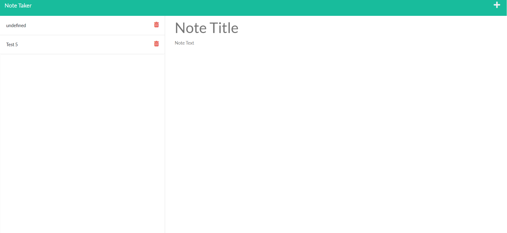

# My Note Taker

## DESCRIPTION

> To create a better understanding of express.js.
> By learning routing and middleware.
> Also it helps keep me organized!

## INSTALLATION

> [Follow link here](https://young-cove-35341.herokuapp.com/)

## USAGE

A note taker app- similar to sticky notes, but on your computer!

## LANGUAGES & TECHNOLOGIES

> JavaScript,ES6,Node and Express.js

## AUTHOR(S)

>

- [Jacob Ambrose](https://www.github.com/jambrose0)
  >

## LICENSE

## PREVIEW

> 
